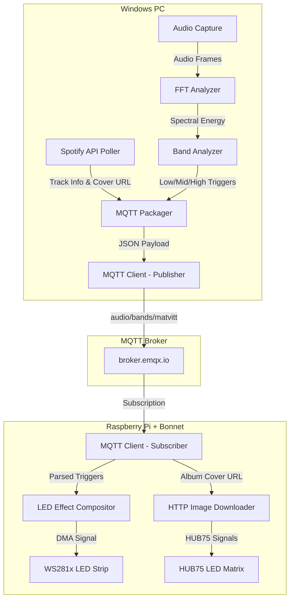

# AudioViz Project Specification & Reference Guide

This document provides a comprehensive reference of the **AudioViz** project's logic, hardware requirements, software libraries, configuration settings, and execution steps. Use this guide to rebuild or refactor the system from scratch.

---

## 1. Project Architecture & Data Flow

The project is split into two nodes: **PC Node (Sender)** and **Raspberry Pi Node (Receiver)**, communicating over the network using MQTT.



### Step-by-Step Logic
1. **Audio Capture (PC):** Captures standard loopback audio from Windows (Stereo Mix or WASAPI loopback) at $44100\text{ Hz}$ or $48000\text{ Hz}$.
2. **Spectral Analysis (PC):** Converts raw audio blocks into frequency domains using real FFT (`np.fft.rfft`) with a Hann window.
3. **Band Triggering (PC):** Sums energy in three bands (Low: 20-200 Hz, Mid: 200-2000 Hz, High: 2000-8000 Hz). If the normalized band energy exceeds pre-set thresholds, the band state is marked `True` (active).
4. **Spotify Metadata (PC):** Polls Spotify’s web API once per second to get the current playing track name, artist, duration, progress, and most importantly, the **album cover image HTTPS URL**.
5. **MQTT Packaging (PC):** Publishes a combined JSON message to `audio/bands/matvitt` containing:
   ```json
   {
     "low": false,
     "mid": true,
     "high": true,
     "spotify": {
       "track_id": "...",
       "track_name": "...",
       "artist_name": "...",
       "album_cover_url": "https://i.scdn.co/...",
       "progress_ms": 12000,
       "duration_ms": 180000,
       "is_playing": true
     }
   }
   ```
6. **Hardware Drivers (RPi):**
   * **LED Strip:** Reads `low` (triggers a red pulse from center), `mid` (triggers green wave movement), and `high` (triggers random white sparkles). Compiles these using an additive layer composer at 30 FPS.
   * **LED Matrix:** When a new `album_cover_url` is received, it downloads the cover, resizes it to $64 \times 64$, and draws it to the HUB75 matrix.

---

## 2. Detailed Configuration Reference (`config.json`)

Here is the complete configuration dictionary schema and physical explanations for each key:

```json
{
  "num_leds": 30,
  "ws281_enabled": true,
  "ws281_gpio": 19,
  "ws281_freq_hz": 800000,
  "ws281_dma": 10,
  "ws281_invert": false,
  "ws281_brightness": 255,
  "ws281_channel": 1,
  "pulse_decay_ms": 120,
  "wave_speed_ms_per_led": 8,
  "sparkle_density": 0.15,
  "effect_mode": "layered",
  "matrix_rows": 64,
  "matrix_cols": 64,
  "matrix_brightness": 100,
  "matrix_hardware_mapping": "adafruit-hat-pwm",
  "matrix_chain_length": 1,
  "matrix_parallel": 1,
  "matrix_row_address_type": 0,
  "matrix_multiplexing": 0,
  "matrix_gpio_slowdown": 4,
  "matrix_pwm_bits": 11,
  "matrix_rgb_sequence": "RGB",
  "matrix_disable_hardware_pulsing": false,
  "matrix_fade_steps": 20,
  "matrix_fade_delay": 0.03,
  "matrix_end_fade_remaining_ms": 1500,
  "matrix_startup_test": false,
  "matrix_startup_test_seconds": 0.5
}
```

### LED Strip Configuration Parameters
* `"num_leds"`: Total number of WS2812B LEDs in the strip (e.g. `30`).
* `"ws281_enabled"`: Toggles the LED strip output on/off. Useful to disable LEDs for testing the matrix.
* `"ws281_gpio"`: The physical Broadcom (BCM) GPIO pin driving the strip data line. We use **`19`** (PWM1) to avoid conflicts.
* `"ws281_freq_hz"`: Operating frequency of the WS2812B LEDs. Always **`800000`** ($800\text{ kHz}$).
* `"ws281_dma"`: The Direct Memory Access (DMA) channel used by the driver. Always use **`10`** on the Pi for safety. (Avoid `5` to prevent filesystem corruption).
* `"ws281_invert"`: Inverts the data signal (needed only if using specific inverting hardware buffers). Set to `false` for direct wiring.
* `"ws281_brightness"`: Overall brightness level of the strip (`0` to `255`).
* `"ws281_channel"`: The hardware PWM channel. Because GPIO 19 uses PWM1, this **must** be set to **`1`**.
* `"pulse_decay_ms"`, `"wave_speed_ms_per_led"`, `"sparkle_density"`: Fine-tuning variables for the layered visual effects.

### LED Matrix Configuration Parameters
* `"matrix_rows"` / `"matrix_cols"`: Height and width of the panel. For your square panel, this is **`64`** by **`64`**.
* `"matrix_brightness"`: Overall brightness of the HUB75 panel (`0` to `100`).
* `"matrix_hardware_mapping"`: The mapping configuration. Since you soldered the GPIO 4-18 mod on the Bonnet, this **must** be **`"adafruit-hat-pwm"`** (Quality Mode).
* `"matrix_gpio_slowdown"`: Delays GPIO transitions to give older panels or longer cables time to catch up. Use **`4`** for Raspberry Pi 4.
* `"matrix_pwm_bits"`: Precision of colors (`1` to `11` bits). Lower values reduce CPU load.
* `"matrix_disable_hardware_pulsing"`: Whether to use CPU or hardware PWM clocks for sub-microsecond timing. Since we soldered the PWM mod, set this to **`false`** to use hardware PWM and get rock-solid, flicker-free images.

---

## 3. Hardware Modifications Reference

To achieve a flicker-free display and keep the LED strip working simultaneously, the hardware was set up as follows:

### 1. Solder Jumper: GPIO 4 to GPIO 18 (Quality Mode)
* **What it does:** Physically bridges the Raspberry Pi's hardware PWM0 channel (on GPIO 18) to the Bonnet's Output Enable (OE) line (on GPIO 4).
* **Software Mapping:** Requires `"matrix_hardware_mapping": "adafruit-hat-pwm"` and `"matrix_disable_hardware_pulsing": false`.
* **Side-Effect:** The Pi's onboard audio module (`snd_bcm2835`) uses the same hardware PWM0 system. Onboard audio **must** be disabled.

### 2. Matrix E-Line Solder Jumper
* **What it does:** Square $64 \times 64$ matrices require 5 address lines (A, B, C, D, E) instead of 4. Since the Bonnet only has 4 channels by default, the E address line must be bridged on the back of the Bonnet.
* **Modification:** Solder the bridge pads on the back of the Adafruit Bonnet to route the E address line (typically shorting the middle pad to **`8`**).

### 3. LED Strip Pin Relocation (GPIO 19)
* **What it does:** WS2812B strips are normally driven by GPIO 18 (PWM0). Since the matrix has commandeered PWM0 for Quality Mode, the LED strip must use the Pi's second PWM channel: **PWM1 (on GPIO 19)**.
* **Software Mapping:** Requires `"ws281_gpio": 19` and `"ws281_channel": 1`.

---

## 4. Software Libraries & System Dependencies

### PC Node (Windows)
Create a Python virtual environment and install:
```bash
pip install sounddevice numpy scipy paho-mqtt spotipy python-dotenv Pillow
```

### Raspberry Pi Node (Linux)
The Pi requires system-level packages, the compiled matrix driver, and Python libraries.

#### 1. System Packages
* **`libjpeg-dev` & `zlib1g-dev`:** **CRITICAL**. These development headers must be installed *before* compiling Pillow, otherwise Pillow will be built without JPEG support and fail to load Spotify's cover art.
* **`git` & `make`:** Required to compile the C++ drivers.

```bash
sudo apt-get update
sudo apt-get install -y libjpeg-dev zlib1g-dev git make python3-dev
```

#### 2. Python Virtual Environment (`.venv`) Libraries
* **`rpi_ws281x`:** The low-level Broadcom PWM library wrapper.
* **`Pillow`:** Python Imaging Library. Must be compiled with JPEG support.
* **`paho-mqtt`:** MQTT Client library (API Version 2).
* **`requests`:** HTTP Client library.
* **`numpy`:** For image manipulation and composition arrays.

```bash
# Inside your virtualenv
pip install paho-mqtt requests numpy rpi_ws281x
pip install --force-reinstall --no-cache-dir Pillow
```

#### 3. Hzeller RGB Matrix C++ and Python Bindings
The HUB75 driver is compiled from source on the Pi:
```bash
# Clone the repository
git clone https://github.com/hzeller/rpi-rgb-led-matrix.git
cd rpi-rgb-led-matrix

# Build the main C++ library
make

# Build and install the Python bindings in your virtual environment
cd bindings/python
source ~/AudioViz/rpi/.venv/bin/activate
pip install .
```

---

## 5. System Configuration Files

### 1. Disable Onboard Audio
To free up the PWM0 controller, disable the onboard Broadcom audio card:
1. Open `/boot/firmware/config.txt` (or `/boot/config.txt` on older OS releases).
2. Find the line: `dtparam=audio=on` and change it to:
   ```text
   dtparam=audio=off
   ```

### 2. Enable Dual-Channel PWM Overlay
To tell the Pi to route the hardware PWM1 signal to the physical GPIO 19 pin, add this line at the bottom of the same config file:
```text
dtoverlay=pwm-2chan
```
*Save the file and reboot the Pi using `sudo reboot`.*

---

## 6. Project Logic Workarounds (Code Fixes)

### 1. Bypassing Virtual Environment SSL/TLS Restrictions
When running Python with `sudo`, standard environment variables often inherit unreadable paths from the user home folder, causing SSL connections to fail. We bypass this by hardcoding the Pi's global system certificate store path:
```python
# Place this at the very top of main.py
import os
os.environ["REQUESTS_CA_BUNDLE"] = "/etc/ssl/certs/ca-certificates.crt"
os.environ["CURL_CA_BUNDLE"] = "/etc/ssl/certs/ca-certificates.crt"
```

### 2. Graceful Config Loading inside MQTT Threads
If the configuration file `config.json` has restricted permissions, reloading it in background threads can trigger permission warnings. We load it successfully once at startup, and then suppress any subsequent permission errors inside the loop:
```python
def _load_cfg():
    global _cfg_mtime, _cfg_last_error, _cfg_last_error_log, N
    try:
        mtime = os.path.getmtime(_CFG_PATH)
        if mtime == _cfg_mtime:
            return
        with open(_CFG_PATH) as f:
            cfg.update(json.load(f))
        _cfg_mtime = mtime
        N = cfg["num_leds"]
    except Exception as e:
        if _cfg_mtime is not None:
            # Silently use the already loaded config if a reload fails
            return
        # Print error only if the initial load fails
        print(f"Config error: {e}")
```

### 3. Desktop User-Agent for Spotify CDNs
Avoid getting blocked by Spotify's CDN security rules. Always make HTTP requests look like standard browser requests:
```python
_HTTP = requests.Session()
_HTTP.headers.update({
    "User-Agent": "Mozilla/5.0 (Windows NT 10.0; Win64; x64) AppleWebKit/537.36 (KHTML, like Gecko) Chrome/122.0.0.0 Safari/537.36",
    "Accept": "image/avif,image/webp,image/apng,image/*,*/*;q=0.8",
})
```

---

## 7. Deployment Checklist & Commands

When setting up your clean workspace, follow this exact progression:

### 1. Update and Config
1. Configure `rpi/config.json` on the PC with your preferred settings.
2. Edit `/boot/firmware/config.txt` on the Pi (add `dtoverlay=pwm-2chan`, set `dtparam=audio=off`, and reboot).

### 2. Secure Copy (PC -> Pi)
From your Windows command prompt, copy the folders:
```bash
scp -r "c:\Users\matvi\OneDrive\Desktop\AudioViz\rpi" matvitt@YOUR_PI_IP:/home/matvitt/AudioViz
```

### 3. File Permissions
Fix permissions on the Pi so that all folders and site-packages are traversable:
```bash
sudo chmod -R 755 /home/matvitt/AudioViz
```

### 4. Running the Script
Run using the virtual environment's python path with `sudo` privileges:
```bash
cd ~/AudioViz/rpi
sudo .venv/bin/python main.py
```
